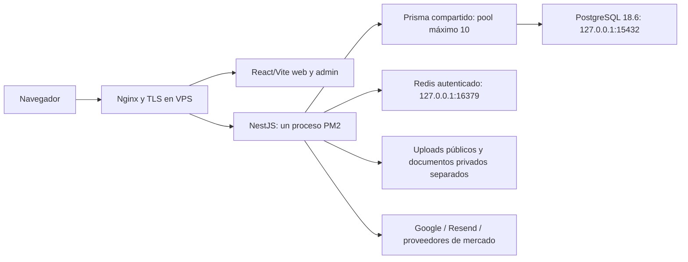

# PostgreSQL nativo de Finix

Estado verificado localmente el 7 de octubre de 2026. PostgreSQL 18.6 corre en Docker; la API usa Prisma 5.22 y NestJS. Web/admin son React con Vite. El VPS conserva su infraestructura anterior hasta un corte posterior.

## Arquitectura



En desarrollo, Vite hace proxy hacia la API loopback; no se cambió el VPS ni se instaló Nginx local. Auth es propio y Google está preparado directamente en API. No existe alta disponibilidad: un único servidor y una base requieren backups externos y un procedimiento de recuperación.

## Conexiones y permisos

`ops/database/compose.yml` publica PostgreSQL y Redis sólo en 127.0.0.1. Redis tiene contraseña hexadecimal generada, protected mode, 128 MB de caché con allkeys-lru, sin persistencia: perder ese caché no pierde información de negocio. Sus secretos están en `ops/database/.secrets`, fuera de Git. [Docker](https://docs.docker.com/engine/network/port-publishing/) documenta la diferencia entre publicar en loopback y en todas las interfaces.

| Rol | Uso | Límites |
|---|---|---|
| finix_bootstrap | Inicialización, inventario y backup por scripts protegidos | Nunca en la API |
| finix_owner | Restauración/migraciones y propietario de public | Sin superusuario, create role/db o bypass RLS; 8 conexiones |
| finix_app | Runtime Prisma | Sin DDL o escritura de _prisma_migrations; sin privilegios administrativos; 15 conexiones |

DATABASE_URL usa finix_app, `connection_limit=10`, pool_timeout=15 y connect_timeout=10. DIRECT_URL usa finix_owner con pool 3. Se quitaron los PrismaService duplicados de Alerts/Watchlist; el módulo global comparte una instancia. El control local observó 5 conexiones idle del rol runtime tras el ensayo; no es el máximo de un pico.

Prisma mantiene la estrategia de relaciones anterior por defecto; los métodos perfilados pueden elegir joins. No se habilita PgBouncer por defecto: con un proceso persistente y pool 10 dentro de max_connections=40 no se demostró presión que justifique otro pooler. Si aparecen múltiples servicios o saturación, medir pg_stat_activity, espera de pool y tasa de conexión antes de agregarlo. Su modo transacción exige revisar Prisma 5.22, statements preparados y DIRECT_URL por separado; no aplicar instrucciones de Prisma 7 a este proyecto.

Se conservaron las 17 tablas con RLS. `permissions.sql` añade políticas explícitas del backend para finix_app sin deshabilitar las políticas existentes. NestJS valida usuario/permisos; el navegador nunca recibe credenciales de la base.

## Perfil conservador de recursos

| Parámetro | Valor preparado |
|---|---|
| max_connections | 40 |
| shared_buffers | 256 MB |
| effective_cache_size | 2 GB, estimación del planificador |
| work_mem | 4 MB por operación que lo requiera |
| maintenance_work_mem | 128 MB |
| Límite contenedor PostgreSQL | 1 GB |
| Límite contenedor Redis | 256 MB |
| statement_timeout del rol runtime | 30 s |
| idle_in_transaction_session_timeout del rol runtime | 30 s |

Estos valores se probaron en una computadora de 8 CPU y ~11,8 GiB de RAM. No se afirma que estén afinados para el VPS actual. Hay una auditoría histórica del VPS en docs/database-migration.md; volver a medir memoria, CPU, disco, swap, otras aplicaciones y límites de contenedor antes del corte. `ops/prepare-vps.sh --check` muestra recursos y contenedores sin modificar infraestructura. `--prepare` exige al menos ~2 GB de RAM total; eso no garantiza RAM disponible ni velocidad suficiente para construir o ejecutar IA.

No asignar porcentajes de toda la RAM del host a PostgreSQL cuando comparte recursos. work_mem se multiplica por operaciones concurrentes y no es una reserva global. Subir valores sólo con mediciones; no activar cluster PM2 mientras jobs y Socket.IO no tengan coordinación compartida.

## Consultas e índices

- getTopTraders filtra perfiles públicos, showStats y totalReturn en SQL; selecciona 9 campos y LIMIT 10. No descarga todos los usuarios ni ordena en memoria. Se eliminó su caché de 5 minutos para que un cambio de privacidad se consulte inmediatamente.
- Post.communityId, Portfolio.userId y Transaction.portfolioId ya tienen índices. Transaction tiene además (portfolioId,date); User dispone del índice de ranking y Follow del índice inverso. Inventario real: 22 índices en esas cinco tablas. No se agregaron duplicados.
- El feed perfilado usa una consulta con relaciones y limita resultados. POST_INCLUDE selecciona campos públicos del autor, relaciones del espectador con take 1 y contadores usados por la interfaz. El estado del gráfico es parte de la publicación; no se quitó para bajar artificialmente el tamaño.
- La lista de comunidades utiliza consulta agrupada de membresías. Noticias y cotizaciones comparten lecturas concurrentes y cachés acotados.
- Los inventarios estáticos señalan posibles findMany sin take y bucles; incluyen consultas internas a todos los movimientos para calcular un saldo exacto. No deben truncarse esos movimientos ni tratar cada marca como un bug. Quedan para profiling los árboles largos de comentarios, exports administrativos y agregaciones de carteras grandes. No se reescribieron todos los métodos financieros sin evidencia.

Se ejecutó EXPLAIN ANALYZE/BUFFERS en lecturas locales: ranking ~0,024 ms, feed ~0,033 ms, cartera por usuario ~0,017 ms y movimientos ~0,025 ms. Con tablas pequeñas, un Seq Scan puede ser la decisión correcta aunque exista el índice. Los planes quedan en el informe privado. Los ensayos sintéticos no predicen tiempos del VPS.

## Caché e invalidación

ReadCacheService aplica Redis al dashboard público de mercado, TTL 5 segundos. Coalesce cargas concurrentes, limita caché de memoria a 200 entradas y vuelve a lectura normal si Redis falla; las operaciones de Redis tienen límite 500 ms y cola acotada. /ready marca Redis unavailable si está configurado y cae, aunque las rutas tengan fallback.

Las escrituras de User, Portfolio, Holding, Transaction, CashAccount, Post, PostLike, Community y AssetAnalysis invalidan por generación. Dentro de $transaction se registra la escritura y se invalida después del commit; rollback no publica ni invalida datos no confirmados. Las lecturas dentro de esas transacciones evitan caché compartido. No se cachean balances privados, ledger, membresías ni decisiones de permisos. Las cotizaciones externas conservan sus TTL propios; el cambio de cartera no exige borrar el precio de mercado del proveedor.

Las pruebas con dos clientes Redis comprobaron coalescing, vencimiento, errores, lectura compartida, invalidación, transacciones callback/array y caída del servidor.

## Observabilidad sin parámetros privados

Se habilita pg_stat_statements por shared_preload_libraries y extensión en finix_monitor. Los datos guardan estadísticas normalizadas; su texto sigue siendo privado. [PostgreSQL](https://www.postgresql.org/docs/current/pgstatstatements.html) advierte que ciertas consultas pueden conservar constantes: no publicar SQL completo.

La API añade X-Request-Id y registra JSON para solicitudes/operaciones de DB de más de 500 ms. FINIX_REQUEST_METRICS=true permite todas las muestras y cabeceras Server-Timing / X-Finix-Db-Operations. Las etiquetas usan rutas parametrizadas, modelo, acción, duración y estado; no añaden body, email, tokens, params financieros ni SQL. dbOperations cuenta llamadas Prisma, no statements SQL; dbMs puede sumar operaciones paralelas y superar el tiempo de una petición.

Se retiró Promise.race de las escrituras Prisma: devolver timeout no cancela una escritura. PostgreSQL aplica el timeout real del rol. Los errores de conexión registran un código sin la URL privada. El perfil del contenedor desactiva log_statement y logs de SQL lento/parámetros; no activa impresiones de consultas con datos financieros.

```bash
node scripts/performance/database-report.cjs /ruta/privada/database-report.json
node scripts/performance/backend-benchmark.cjs 4a1625db /ruta/privada/backend.json --database
node scripts/performance/concurrent-local.cjs /ruta/privada/carga.json
```

database-report sólo lee, usa el secreto bootstrap protegido y exporta configuración, conexiones, índices, planes y query IDs. EXPLAIN contiene valores de filtros: el informe completo es privado. Los otros benchmarks son locales; el de carga bloquea escrituras/red externa y omite throttling exclusivamente dentro de su proceso de ensayo. No ejecutarlos contra producción para simular 100 clientes.

## Operación y recuperación

No reinstalar ni borrar el volumen para detener/reiniciar. Compose puede recrear el contenedor manteniendo su volumen. Cambiar major de PostgreSQL requiere un plan propio de upgrade/restauración; no cambiar la etiqueta sin verificar. Roles/contraseñas existentes se conservan salvo una rotación coordinada con API/migraciones/backups.

El backup/restauración, la retención y el primer corte están documentados en PRODUCTION.md y docs/database-local-vps.md. El dump público contiene _prisma_migrations; restaurarlo antes de migrate deploy. La historia anterior mezcla SQLite y PostgreSQL: una base vacía no puede inicializarse recorriendo esa historia.

Tras un corte, la base nueva puede recibir escrituras que no existen en Supabase. Un rollback de la conexión requiere congelar escritores, respaldar ambos lados y reconciliar esos cambios. Volver simplemente a la URL anterior puede perder información reciente.
